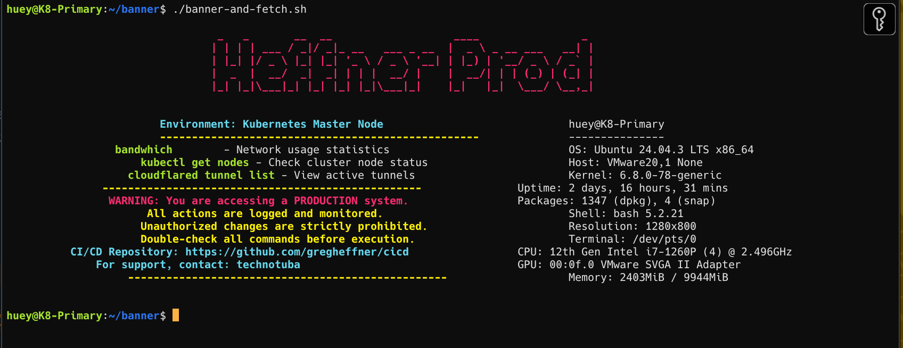

# Banner and Fetch Script

This repository contains the `banner-and-fetch.sh` script.

## Description

`banner-and-fetch.sh` is a shell script designed to display a banner and perform fetch operations. It is intended for use in Unix-like environments (macOS, Linux) and can be executed from the terminal.

## Usage

1. Open your terminal.
2. Navigate to the `banner` directory:
   ```sh
   cd /banner
   ```
3. Make the script executable (if not already):
   ```sh
   chmod +x banner-and-fetch.sh
   ```
4. Run the script:
   ```sh
   ./banner-and-fetch.sh
   ```


## Requirements

- macOS or Linux
- Bash or compatible shell
- figlet (for banner display)

## Setup

To install required packages, run:

```sh
brew install figlet   # macOS
sudo apt-get install figlet   # Ubuntu/Debian
```

## License

This project is licensed under the MIT License.
